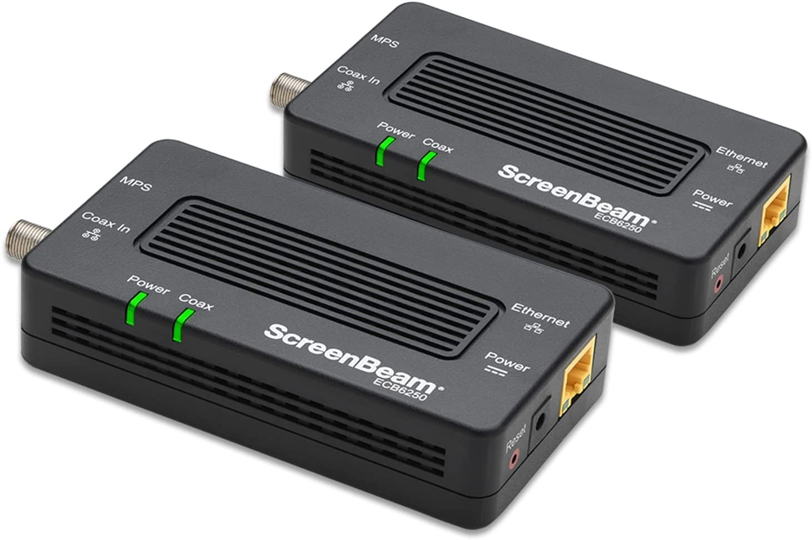
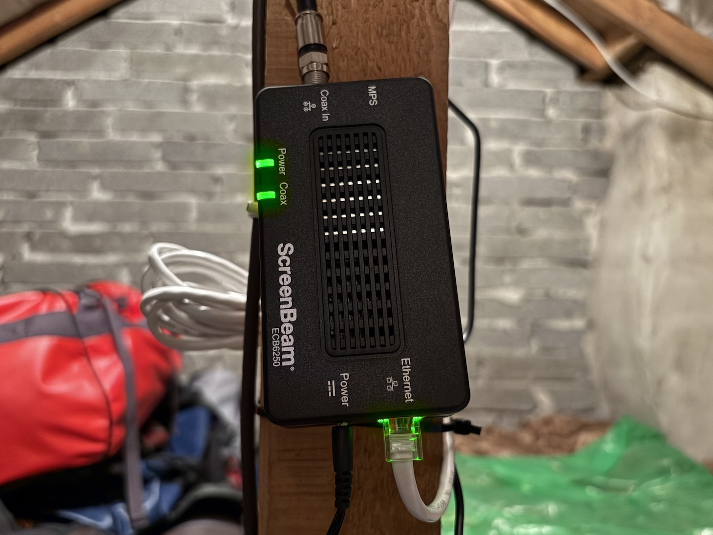
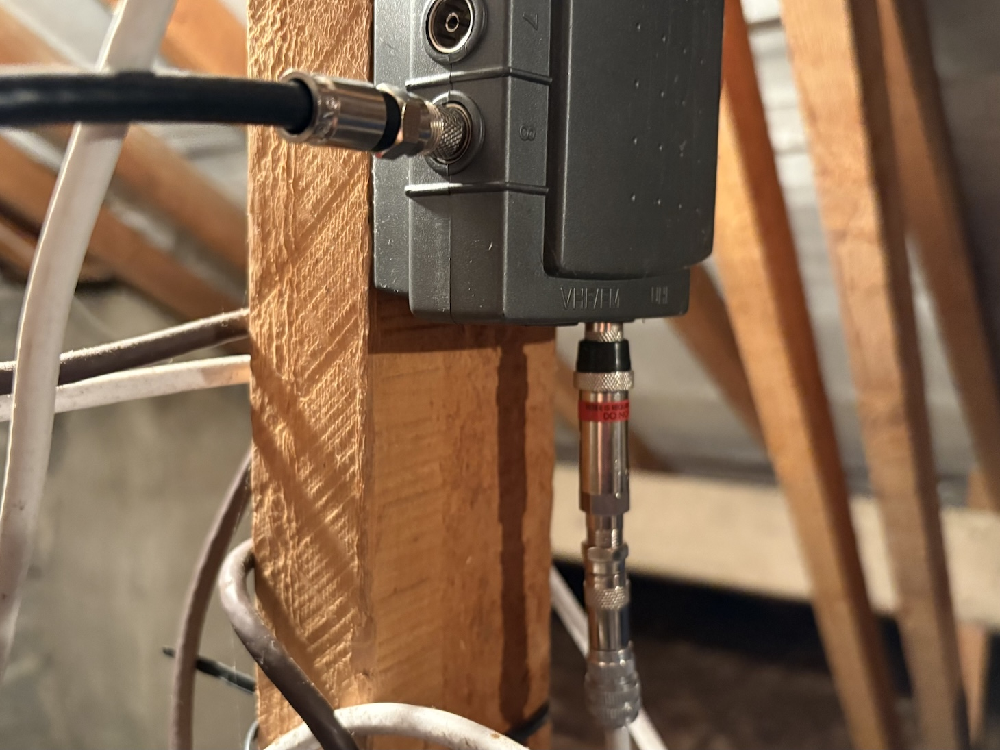

MoCA (Multimedia over Coax Alliance) allows coaxial cables to be used instead of Ethernet cables. This is particularly useful when there are coaxial cables already installed such as feeding from a roof aerial down into, and around, a house, and where it would be desirable to use these cables for networking purposes instead of running new Ethernet cables between rooms.

***

I've been wanting to place a wireless access point in the attic for better coverage upstairs, and conveniently there's already a coax cable run from the living room to the attic (for the TV aerial). I was going to use the coax to pull through some Ethernet cable, but the coax is either caught up on something or has been stapled. I didn't want to risk damaging the coax, so I decided to try MoCA instead...

I bought a pair of MoCA adapters, the [ScreenBeam MoCA 2.5](https://www.screenbeam.com/products/ecb6250/), which are slightly confusingly rated for 2.5 Gbps ("over MoCA") but only have gigabit Ethernet (this is fine for my usage, but there is higher price unit available that offers 2.5 Gbps Ethernet). The adapters simply plug in to coax at one end, Ethernet and also power at the other, and require no configuration.

<figcaption>ScreenBeam ECB6250</figcaption>

I have one unit in the living room connected to an Ethernet switch on one end and the TV aerial socket on the other, and the second unit in the attic connected to the wireless access point via Ethernet and also to an (existing) TV aerial splitter. The ScreenBeam units came with coax splitters which in theory allow the TV to remain connected to the aerial, but I didn't bother with these as I'm not using terrestial TV.

<figcaption>ScreenBeam unit mounted in the attic, coax from the aerial splitter (top) and Ethernet to the AP (bottom)</figcaption>

I did also have to pick up a few F-type couplers to connect the existing aerial sockets and the aerial splitter to the MoCA adapters (as well as some male / female swap outs to get all of the things pointing in the right direction), and a "PoE" ("Point of Entry" _not_ "Power over Ethernet") MoCA filter to prevent the MoCA signal from leaking out of the house since it's routed into the TV aerial through the splitter, and I don't want my network traffic spewing out over the neighourhood!

<figcaption>Aerial splitter with coax cable + adapter to ScreenBeam (top left) and PoE filter attached to the aerial cable (bottom)</figcaption>

Interestingly it's quite hard to find MoCA gear, and any information on their usage, in the UK. Whilst I have seen the ScreenBeam on sale in the UK on occasion I ended up buying mine from the US for around $120 for the pair.

Performance-wise these have met my expectations (ie. no noticeable difference to 1 Gbps Ethernet), and the wireless AP in the attic is working well. I'm happy with the setup and would recommend MoCA for anyone in a similar situation - it's probably (a little?) cheaper than paying someone to run Ethernet cables, and definitely a lot less faff than doing so yourself, particularly if you want to connect up multiple rooms that already have coax cable runs.

