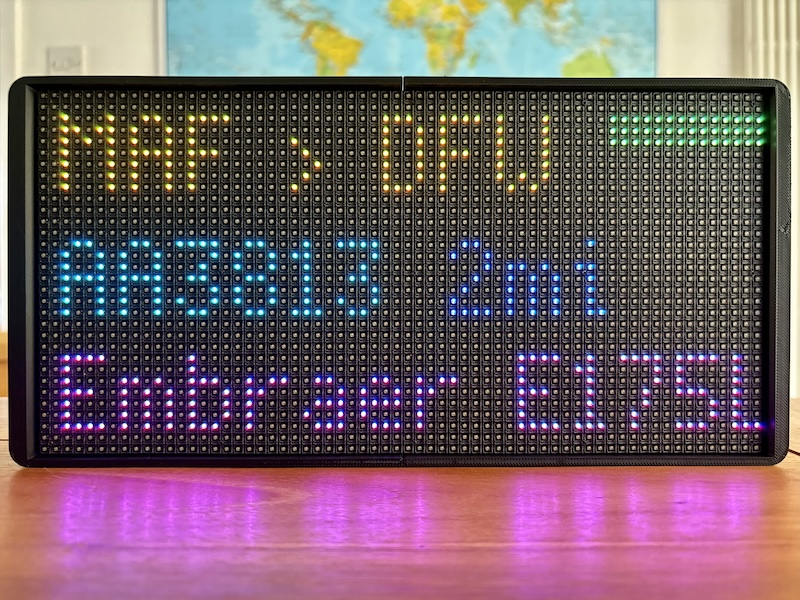
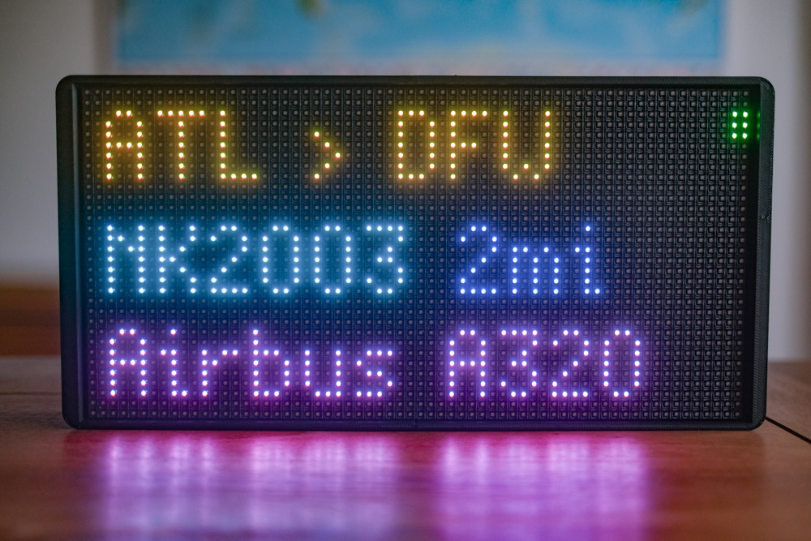
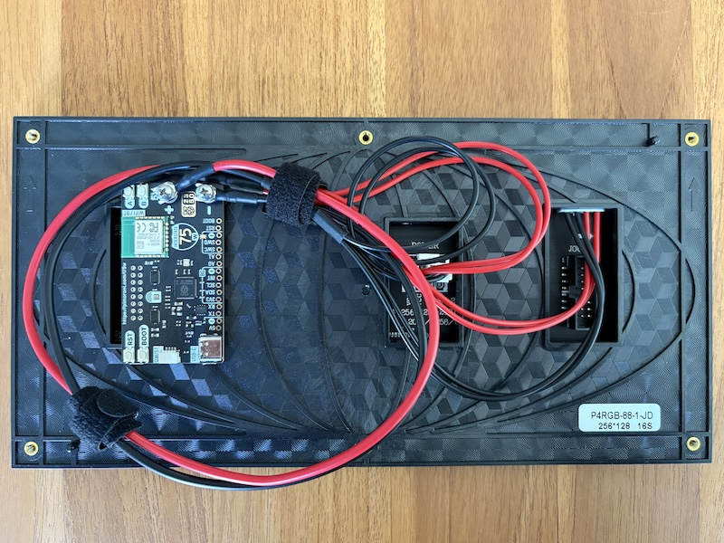
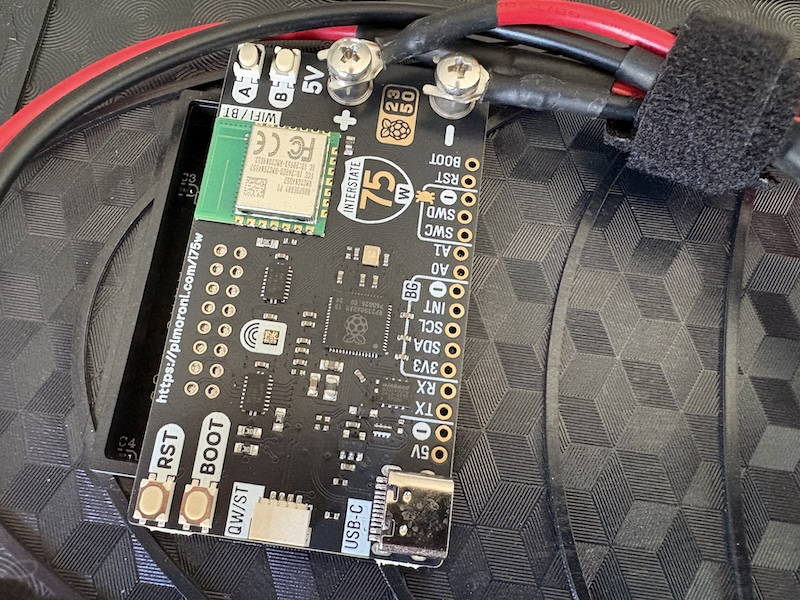

My parents-in-law live under the flight path of a major airport (DFW), and my father-in-law is a bit of an aviation enthusiast so I wanted to set up a display for him that would show flight information for nearby aircraft.

This was heavily inspired by the [excellent work done by Colin Waddell](https://blog.colinwaddell.com/articles/flight-tracker), but differs in some of the hardware choices and the software architecture.

_I've also just noticed, whilst writing this post, Colin's [very recent update](https://blog.colinwaddell.com/articles/dotbox-an-improved-flight-tracker) on building a commercial version of his flight tracker, so do check that out if you're interested in a ready-made solution!_



Having previously set up a Raspberry Pi + [ADS-B receiver](https://thepihut.com/products/flightaware-pro-stick-plus-usb-sdr-ads-b-receiver) for my father-in-law (which pushes data to all of the major flight tracking services; Flightradar24, FlightAware, ADS-B Exchange, AirNav Radar and PlaneFinder), the next step was to create a display that would sit on the office desk and show the source, destination, flight number, distance and aircraft type for planes visibly / audibly flying overhead.

## Hardware

The hardware for this project was very simple:
- [64x32 LED Matrix Display](https://shop.pimoroni.com/products/rgb-led-matrix-panel?variant=42312764298)
- [Pimoroni Interstate 75 W RGB LED Matrix Driver](https://shop.pimoroni.com/products/interstate-75-w?variant=54977948713339) (I75) with the Raspberry Pi RP2350 chip, rather than a full-blown Raspberry Pi board (eg. Zero 2 W)
- A [3D-printed case](https://www.thingiverse.com/thing:5793070) to hold the display and I75

I had tested an [InkyFrame](https://shop.pimoroni.com/products/inky-frame-7-3?variant=40541882089555) E Ink display at first, but found the refresh rate too slow for my liking (and the flickering during each refresh cycle was too distracting for something meant to sit on a desk). I'm probably going to repurpose the InkyFrame for a weather forecast display instead (where it can sit for ages consuming very little power, only refreshing every couple of hours).

## Software

The data source for the flight information is [Flightradar24's](https://www.flightradar24.com/) (FR24) API, via the [FlightRadarAPI Python package](https://pypi.org/project/FlightRadarAPI/), which I query from a server rather than the I75 device itself.

I wanted to keep the on-device software as simple as possible, partly due to resource constraints, partly to make it easier to maintain as:
- I may want to build more of the displays in future, so running them against something centralised and off-device would make this easier
- The device would be a long way from me (ie. transatlantic) most of the time, so physical access would be very limited once set up
- I'm slightly wary of the FR24 free API accessed via the Python package; it seems as if FR24 are moving towards a paid API model, so I wanted to keep the display code as simple as possible to make it easier to swap out the data source in future if needed (whilst keeping the shape of the data returned the same, requiring no changes to the device code)

### Server component

The source for the server component is available on GitHub: [https://github.com/grega/flight-finder](https://github.com/grega/flight-finder)

In brief, it allows to search by location and radius, returning the flight information for the closest aircraft:

```json
➜  ~ curl -H "X-API-Key: <api-key>" \
  "https://flight-finder.gregdev.com/closest-flight?lat=xx.xxxx&lon=-xx.xxxx&radius=30" | jq
{
  "distance_km": 6.55,
  "flight": {
    "aircraft": {
      "code": "A21N",
      "model": "Airbus A321-253NX",
      "registration": "N467AL"
    },
    "airline": {
      "iata": "AA",
      "icao": "AAL"
    },
    "callsign": "AAL2572",
    "icao_24bit": "A5B3A7",
    "id": "3d2a4a50",
    "number": "AA2572",
    "position": {
      "altitude": 3100,
      "ground_speed": 194,
      "heading": 180,
      "latitude": 33.0649,
      "longitude": -97.0253,
      "vertical_speed": -768
    },
    "route": {
      "destination_iata": "DFW",
      "destination_name": "Dallas Fort Worth International Airport",
      "origin_iata": "ANC",
      "origin_name": "Anchorage Ted Stevens International Airport"
    }
  },
  "found": true
}
```

The server is build using Flask (I'd usually reach for Ruby and Sinatra as I don't write Python often, as you'll likely be able to tell, but thought it would at least be nice to keep the whole stack in Python). It's hosted on a small VPS set up to be multi-tenant and easy to deploy to using [Dokku](https://dokku.com/) (my go-to for running small / medium applications in a Heroku-like environment). There are instructions on setting that up here: [https://github.com/grega/flight-finder/blob/main/docs/dokku.md](https://github.com/grega/flight-finder/blob/main/docs/dokku.md)

### Device software

For the device I wrote a simple MicroPython script that runs on the Raspberry Pi RP2350 chip on the Interstate 75 W board (using [Pimoroni's Interstate 75 library](https://github.com/pimoroni/interstate75)), which queries the server every minute (configurable) and displays the flight information on the LED matrix:

[https://github.com/grega/flight-finder/tree/main/examples/interstate75](https://github.com/grega/flight-finder/tree/main/examples/interstate75)

There are some utility functions to format the flight information nicely for display's limited screen space and resolution, a bar animation for showing how long until the next refresh, "bright mode" for high levels of ambient light (the default is a little more subdued), along with a "quiet time" option for turning the display off automatically during certain hours (eg. overnight).

I've kept this as simple as I felt was appropriate, and there's certainly room for improvements / nice-to-haves (see ["future work" below](#future-work)).

## Case

I printed a simple case (in 2 parts, using PLA) to hold the display and driver board, it's available on Thingiverse: [https://www.thingiverse.com/thing:5793070](https://www.thingiverse.com/thing:5793070)

The case has holes for mounting directly to the screw threads on the back of the LED matrix so assembly was straightforward (though do check your LED matrix aligns first before printing, as there can be variations in layout depending on the manufacturer). I filled in the side cutout prior to printing and did have to add a cutout at the back for the power (via a right-angled USB-C cable) as I preferred to run the cable out of the back (for desk mounting) rather than the side (which would be more suitable for wall mounting).

My father-in-law enjoys woodoworking, so he might well swap out the 3D-printed case for something a little nicer in future.

## Result


<figcaption>The Flight Finder Display showing flight information</figcaption>


<figcaption>The Flight Finder Display showing flight information (and "refresh bar" depleting)</figcaption>


<figcaption>LED Matrix with I75 connected (there are two power connectors for powering dual-displays, the one in the centre actually provides power whilst the one top right is just tucked up out of the way)</figcaption>


<figcaption>The I75 close up</figcaption>

Thanks again to [Colin](https://blog.colinwaddell.com/articles/flight-tracker) for the original inspiration. I'm also hopeful that others will find this somewhat different implementation useful, assuming they have similar use cases to mine.

## Future work

Scrolling text for the (often quite long) aircraft type / model would be a nice addition. It's currently truncated to fit the display which mostly works _fine_.

I might look at pulling the flight data from the local ADS-B receiver in future, rather than relying on FR24's API (or remote APIs in general), though I'm aware that these APIs tend to have more complete data (airline, flight number, origin / destination) than what is typically available from the raw ADS-B data so this might not be feasible (or might involve levels of calculation, and correlation with static / on-board data, that could push the limits of the RP2350).
