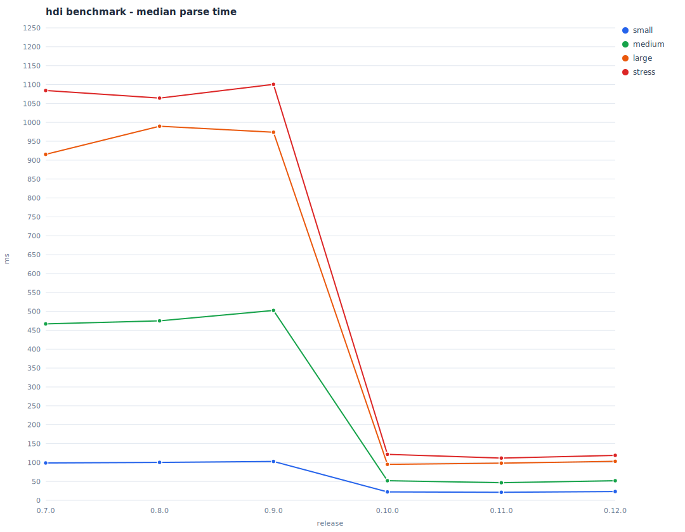

"How do I ... run this thing?"

Switching between projects often can be a pain. Ruby, Python, Node, Go etc each with its own setup ritual. The cycle is always the same; fire up a code editor, open up the project and its `README.md` file, hunt for the `## Installation` or `## Getting Started` section, find the code block(s), copy / paste into the terminal. Repeat. Even with projects that have been set up and that I've used plenty of times; "Does this one use `npm run start` or is it `npm run dev`, or is this one actually `jekyll serve`? Oh, `yarn start`? Ah, no this one _does_ use `docker compose`".

It's a small friction, but I wanted something I could type in any project directory that would just show me the commands I need. No editor, no scrolling, no context switching. Just, how do I get this thing up and running?

A first attempt: [hdi](https://github.com/grega/hdi) - "How do I..."

## The initial script

The initial version was intentionally simple. A Bash script that scans a project's README for markdown headings matching keywords like *install*, *setup*, *prerequisites*, *run*, *usage*, and *getting started*, then extracts the fenced code blocks from those sections and prints them:

```shell-session
$ cd project-name
$ hdi
[hdi] project-name

 ▸ Installation
  python3 -m venv venv
  source venv/bin/activate
  pip install -r requirements.txt

 ▸ Running
  python main.py
```

READMEs are of course wildly inconsistent. Some use `## Set Up`, others `## Getting Started`, others `### Quick Start`, the list goes on. Code blocks might be indented inside numbered lists. And you don't want to see JSON response examples mixed in with actual commands, so the script needs to filter out blocks tagged with languages like `json`, `yaml`, `xml`, `env`, and so on.

By default, `hdi` outputs what it considers to be the most relevant commands across all sections (installation, running, testing). Mode flags allow for narrowing down to just certain sections:

- `hdi install`
- `hdi run`
- `hdi test`

or:

- `hdi i`
- `hdi r`
- `hdi t`

## Going interactive

The static output was useful, but I kept thinking; I can *see* the command I want to run, I should probably run it from here (or at least be able to copy it).

Somewhat inspired by [fzf](https://github.com/junegunn/fzf) which I use heavily, the next step was an interactive picker:

<video autoplay loop muted>
	<source src="/img/hdi-demo.mp4" type="video/mp4">
</video>

Arrow keys to navigate, Enter to execute, `c` to copy to clipboard, `q` to quit. The picker draws inline, no alternate screen buffer, so the terminal context stays visible above it, and on quit it erases itself cleanly.

## The parsing problem

The ongoing challenge is extraction quality. Every project structures its README differently, and the parser needs to handle all of them gracefully. Some examples from the [test fixtures](https://github.com/grega/hdi/tree/main/test):

- Standard `## Installation` with top-level code blocks
- Code blocks indented inside numbered list items (common in Python READMEs)
- `## Set Up` / `## Run` heading variants (common in Rails)
- `## Quick Start` as a combined install-and-run section
- Console-style code blocks with `$ ` prompt prefixes that need stripping
- Inline backtick commands (`` `yarn test` ``) extracted from prose
- READMEs with no matching sections at all (graceful failure)

Each edge case discovered in the wild becomes a new test fixture and a new parsing rule. This is very much still in progress and there are plenty of opportunities to improve the parser and increase the test coverage.

## Release process

As the project grew a little more in scope, particularly when consideraing that others might actually use it, I wanted a release workflow that would catch regressions, particularly performance-related. The [`release`](https://github.com/grega/hdi/blob/main/release) script handles version bumping, tagging, pushing, and also benchmarking in one command:

```
./release <major|minor|patch>
```

This bumps the version in the script, runs the benchmark suite, generates an updated performance chart (which is also rendered and stored as [an SVG in the repo](https://github.com/grega/hdi/blob/main/bench/results.svg)), commits everything, tags it, pushes, then prints the sha256 hash needed to update the [Homebrew tap formula](https://github.com/grega/homebrew-tap/blob/main/Formula/hdi.rb).

## Automated demos with VHS

There's also a simple programmatic [demo system](https://github.com/grega/hdi/tree/main/demo), built with [VHS](https://github.com/charmbracelet/vhs). VHS allows for scripting terminal interactions in a `.tape` file; keystrokes, pauses, commands etc. These are rendered as [a GIF](https://github.com/grega/hdi?tab=readme-ov-file#example).

This serves double duty; the GIF is used in the README as a demo, but it's also a handy visual regression test. Because the GIF is committed to the repo, any change to `hdi`'s output shows up as a diff in pull requests. It's surprisingly effective at catching things like broken formatting or unexpected colour changes that unit tests wouldn't flag.

## Testing

The [test suite](https://github.com/grega/hdi/tree/main/test) uses [bats-core](https://github.com/bats-core/bats-core) with a moderate set of fixture READMEs representing different project styles. CI runs shellcheck for linting, then the full bats suite on both Ubuntu and macOS. The fixture collection grows every time I come across a README that `hdi` doesn't handle well.

## Performance

For a tool that's meant to feel instant, performance matters. The [v0.10.0 release](https://github.com/grega/hdi/releases/tag/v0.10.0) brought significant improvements by eliminating subshell overhead.

The original implementation made heavy use of pipelines like `echo "$text" | grep -qiE "$PATTERN"`. Pretty readable, but each pipe spawns a subshell and forks an external process. The [optimisation work](https://github.com/grega/hdi/releases/tag/v0.10.0) replaced these with native Bash builtins: `shopt -s nocasematch` with `[[ =~ ]]` for pattern matching, parameter expansion for string manipulation, and pre-compiled regex patterns at startup to avoid rebuilding them in loops (Claude Code was particularly helpful in expanding my very limited understanding of this topic).

The results across different README sizes before and after the optimisation are pretty striking:

| Test size | Before (ms) | After (ms) | Improvement |
|-----------|-------------|------------|-------------|
| Small     | 104         | 25         | ~76%        |
| Medium    | 478         | 58         | ~88%        |
| Large     | 970         | 106        | ~89%        |
| Stress    | 1101        | 132        | ~88%        |

As mentioned above, benchmarking runs automatically as part of the release process, so performance trends are tracked across every release:



## What's next

There's still plenty to do. The parser is the area with the most room for improvement; handling more README conventions, better heuristics for distinguishing actual commands from example output, and perhaps even some awareness of project type (eg. detecting a `package.json` or `Gemfile` to prioritise relevant sections).

The source is on GitHub: [github.com/grega/hdi](https://github.com/grega/hdi)

Install with Homebrew: `brew install grega/tap/hdi`

[Feedback](https://github.com/grega/hdi/issues) welcome!
