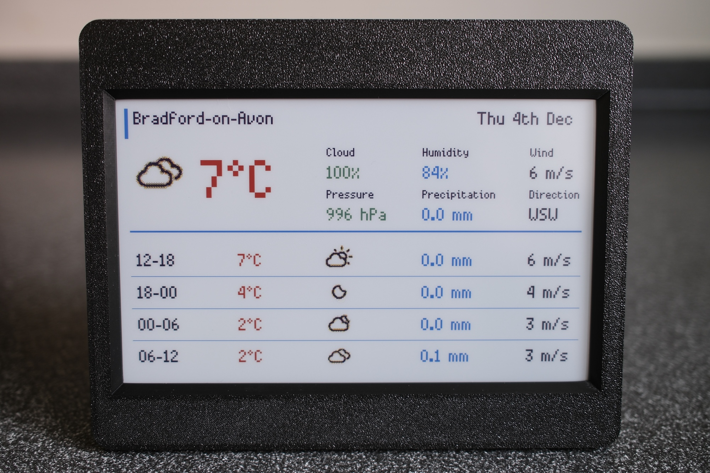

I had picked up Pimoroni’s Inky Frame 7.3" E Ink display to test out for my previous [flight finder display project](posts/2025-11-19-flight-finder-display) but the the slow refresh rate and few seconds of flashing when re-rendering (every minute or so) was frankly too distracting, which is why I switched to using an LED matrix. The Inky Frame, however, seemed perfect for something needing far less frequent updates. A weather dashboard to sit on the kitchen counter seemed like a good fit.

All code is available on [GitHub](https://github.com/grega/pico-projects/tree/main/inky-frame-weather-dashboard).



## Hardware

- [Pimoroni Inky Frame 7.3"](https://shop.pimoroni.com/products/inky-frame-7-3) (Spectra 6 display)
	- The Inky Frame includes a Raspberry Pi Pico 2 W pre-installed
- Either a Micro USB power connector or battery pack (see Pimoroni's [Inky Frame "getting started" page](https://learn.pimoroni.com/article/getting-started-with-inky-frame) for more info)
- MicroSD card for weather icons
- A snap-on printed case, sourced from [MakerWorld](https://makerworld.com/en/models/210940-inky-frame-7-3-clean-cover-snap-on-easy-print#profileId-230780)

## Weather data

The dashboard uses the excellent [YR.no API](https://developer.yr.no/) which is free, and easy to query for hourly forecasts.

The rendered dashboard is similar to the "card" widget that YR provides, eg. [https://www.yr.no/en/content/2-2654991/card.html](https://www.yr.no/en/content/2-2654991/card.html)

(see the [YR docs](https://developer.yr.no/doc/guides/available-widgets/) on how to generate a card view URL for your location).

## The display

The Pimoroni [Inky Frame firmware](https://github.com/pimoroni/inky-frame) along with [PicoGraphics](https://github.com/pimoroni/pimoroni-pico/blob/main/micropython/modules/picographics/README.md) make things nice and simple to work with.

Weather icons were sourced from [Erik Flowers' Weather Icons collection](https://github.com/erikflowers/weather-icons), converted to JPEG for straightforward decoding on the Pico, and copied to the MicroSD card.

I also implemented a very simply ASCII renderer to simulate the display in the terminal for easier debugging without needing to send changes to the Inky Frame all of the time (and wait for it to refresh):

```
================================================================================
Weather for Bradford-on-Avon
Sun 30th Nov
--------------------------------------------------------------------------------
Temperature:         5°C
Icon:                wi-night-alt-cloudy.jpg

Cloud:               100%
Pressure:            1014 hPa
Humidity:            86%
Precipitation:       0.0 mm
Wind:                4 m/s
Direction:           SSW
--------------------------------------------------------------------------------
Time       Icon                      Temp    Precip   Wind
--------------------------------------------------------------------------------
19-00      wi-night-alt-cloudy.jpg   5°C     0.0 mm   4 m/s
00-06      wi-rain.jpg               8°C     7.3 mm   8 m/s
06-12      wi-rain.jpg               10°C    2.9 mm   11 m/s
12-18      wi-rain.jpg               12°C    6.9 mm   12 m/s
================================================================================
```

On the subject of updates, the dashboard fetches weather data every hour and, at the same time, checks if there is a new version of the code available on GitHub. If so, it downloads the updates and attempts to execute them (with a fallback / restore process to attempt to avoid bricking). This makes it easy to deploy updates once the device is in place, without having to hook up a USB cable.
